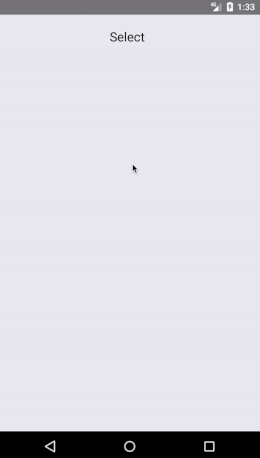

# react-native-pickerise

[![Dependencies][prod-dependencies-badge]][prod-dependencies]
[![Dependencies][dev-dependencies-badge]][dev-dependencies]
[![Code Climate score][codeclimate-score-badge]][codeclimate-score]
[![Coveralls][coveralls-coverage-badge]][coveralls-coverage]
[![Code Climate coverage][codeclimate-issues-badge]][codeclimate-issues]
[![Node.js version][nodejs-badge]][nodejs]
[![NPM version][npm-badge]][npm]
[![Build Status][travis-badge]][travis-ci]
[![Security version][security-version-badge]][security-version]
[![MIT License][license-badge]][LICENSE]
[![PRs Welcome][prs-badge]][prs]


## Description

React Native cross-plateform (iOS/Android) modal picker/selector highly customizable.

## Install

```
$ npm install @rimiti/react-native-pickerise --save
```

## Demo

# [](https://github.com/rimiti/react-native-pickerise) [](https://greenkeeper.io/)

## Examples 

```
import React, {Component} from 'react';
import {StyleSheet} from 'react-native';
import Pickerise from '@rimiti/react-native-pickerise';

export default class Example extends Component {
	constructor(props) {
		super(props);
	}

	render() {
		const items = [
			{ section: true, label: 'Cars' }, { label: 'Audi' }, { label: 'Dodge' }, { label: 'Ford' }, { label: 'Renault' },
			{ section: true, label: 'Bikes' }, { label: 'Kawasaki' }, { label: 'Suzuki' }, { label: 'Triumph' }
		];
		
		return (
			<Pickerise
				itemsContainerStyle={styles.itemsContainerStyle}
				itemsChildStyle={styles.itemsChildStyle}
				itemStyle={styles.itemStyle}
				itemTextStyle={styles.itemTextStyle}
				selectTextStyle={styles.selectTextStyle}
				selectStyle={styles.selectStyle}
				sectionStyle={styles.sectionStyle}
				sectionTextStyle={styles.sectionTextStyle}
				cancelStyle={styles.cancelStyle}
				cancelTextStyle={styles.cancelTextStyle}
				items={items}
				initValue="Select"
				cancelText="Cancel"
				onChange={(item) => console.log(`You chose ${item.label}`)} />
		)
	}
}

const styles = StyleSheet.create({
	itemsContainerStyle: {
		borderRadius: 0,
		backgroundColor: 'transparent',
		marginBottom: 30,
		padding: 0,
	},
	itemsChildStyle: {
		paddingHorizontal: 0
	},
	itemStyle: {
		marginTop: 10,
		backgroundColor: '#919191',
		borderBottomColor: 'transparent',
	},
	itemTextStyle: {
		color: '#fff',
		fontSize: 18,
	},
	selectTextStyle: {
		color: '#000',
		fontSize: 20,
	},
	selectStyle: {
		borderWidth: 0,
		paddingTop: 21,
		paddingLeft: 0,
	},
	sectionStyle: {
		borderRadius: 0,
	},
	sectionTextStyle: {
		fontSize: 20,
		color: '#fff',
	},
	cancelStyle: {
		backgroundColor: '#22A7F0',
		paddingVertical: 20,
		alignItems: 'center',
		justifyContent: 'center',
		marginBottom: 15,
		borderRadius: 0,
	},
	cancelTextStyle: {
		color: "#FFF",
		fontSize: 18,
	},
});

```

## Documentation

```
Props                     Type                  Description                                                 Usage
----------------------------------------------------------------------------------------------------------------------
items                     {array of objects}    With a unique key and label
onChange                  {function}            Callback function, when the users has selected an item      (optional)
initValue                 {string}              Text that is initially shown on the button                  (optional)
cancelText                {string}              Text of the cancel button                                   (optional)
style                     {object}              Style definitions for the global element                    (optional)
itemsContainerStyle       {object}              Style definitions for the items container element           (optional)
itemsContainerChildStyle  {object}              Style definitions for the itemsChild element                (optional)
selectStyle               {object}              Style definitions for the select element                    (optional)
itemStyle                 {object}              Style definitions for the item element                      (optional)
cancelStyle               {object}              Style definitions for the cancel element                    (optional)
sectionStyle              {object}              Style definitions for the section element                   (optional)
overlayStyle              {object}              Style definitions for the overlay element                   (optional)
itemTextStyle             {object}              Style definitions for the item text element                 (optional)
sectionTextStyle          {object}              Style definitions for the section text element              (optional)
cancelTextStyle           {object}              Style definitions for the cancel text element               (optional)
selectTextStyle           {object}              Style definitions for the select text element               (optional)
modalAnimationType        {none, slide, fade}   Modal animation type                                        (optional)
modalTransparent          {bool}                If true render the modal with transparent background        (optional)
```

## Scripts

Run using npm run <script> command.

    clean - remove coverage data, Jest cache and transpiled files,
    lint - lint source files and tests,
    test - lint, typecheck and run tests with coverage,
    test-only - run tests with coverage,
    test:watch - interactive watch mode to automatically re-run tests,
    build - compile source files,
    build:watch - interactive watch mode, compile sources on change.


## License
MIT © [Dimitri DO BAIRRO](https://github.com/rimiti/react-native-pickerise/blob/master/LICENSE)

[prod-dependencies-badge]: https://david-dm.org/rimiti/react-native-pickerise/status.svg
[prod-dependencies]: https://david-dm.org/rimiti/react-native-pickerise
[dev-dependencies-badge]: https://david-dm.org/rimiti/react-native-pickerise/dev-status.svg
[dev-dependencies]: https://david-dm.org/rimiti/react-native-pickerise?type=dev
[security-version-badge]: https://nodesecurity.io/orgs/dim-solution/projects/d7cd94b1-ac5e-45d8-a6af-d2847538a059/badge
[security-version]: https://nodesecurity.io/orgs/dim-solution/projects/d7cd94b1-ac5e-45d8-a6af-d2847538a059
[codeclimate-score-badge]: https://api.codeclimate.com/v1/badges/7951ca62e66be94eba69/maintainability
[codeclimate-score]: https://codeclimate.com/github/rimiti/react-native-pickerise/maintainability
[coveralls-coverage-badge]: https://coveralls.io/repos/github/rimiti/react-native-pickerise/badge.svg
[coveralls-coverage]: https://coveralls.io/github/rimiti/react-native-pickerise
[codeclimate-issues-badge]: https://codeclimate.com/github/rimiti/react-native-pickerise/badges/issue_count.svg
[codeclimate-issues]: https://codeclimate.com/github/rimiti/react-native-pickerise
[nodejs-badge]: https://img.shields.io/badge/node->=%206.9.0-blue.svg?style=flat-square
[nodejs]: https://nodejs.org/dist/latest-v6.x/docs/api/
[npm-badge]: https://img.shields.io/badge/npm->=%203.10.8-blue.svg?style=flat-square
[npm]: https://docs.npmjs.com/
[travis-badge]: https://travis-ci.org/rimiti/react-native-pickerise.svg?branch=master
[travis-ci]: https://travis-ci.org/rimiti/react-native-pickerise
[license-badge]: https://img.shields.io/badge/license-MIT-blue.svg?style=flat-square
[license]: https://github.com/rimiti/react-native-pickerise/blob/master/LICENSE
[prs-badge]: https://img.shields.io/badge/PRs-welcome-brightgreen.svg?style=flat-square
[prs]: http://makeapullrequest.com
